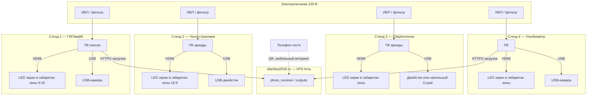
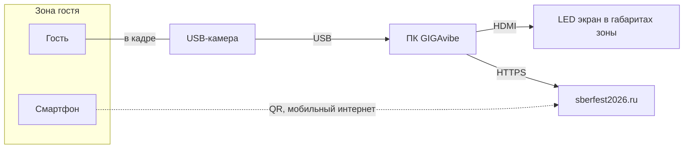
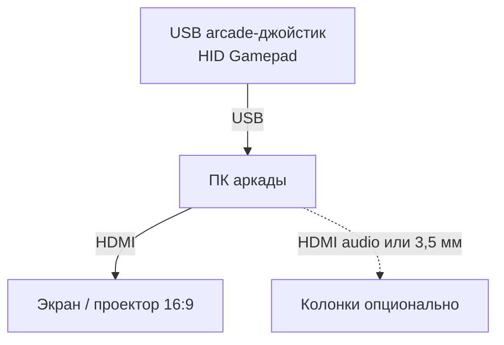
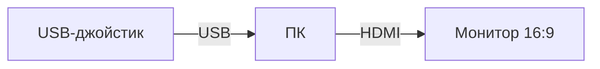
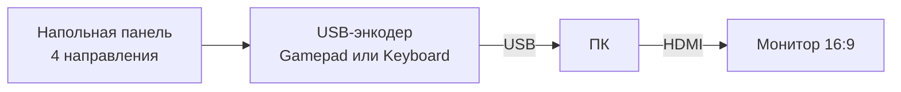
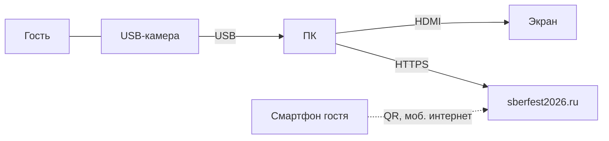

# Схемы подключения оборудования

**Основание:** [ТЗ для заказчика](ТЗ-для-заказчика-фестиваль-интерактивы.docx) · павильон «Сбер на летних фестивалях 26'»

Каждый интерактив — **отдельный компьютер** и **LED‑экран в габаритах зоны** (не бытовой монитор «сбоку»). На стендах с QR (**ГИГАвайб**, **Улыбкометр**) ПК **выгружает результат в интернет** (хостинг/CDN); гость сканирует QR **собственным мобильным интернетом** (LTE/5G) и скачивает файл по ссылке. Игровые аркады (**Чилл‑страховка**, **СберКопилка**) после настройки работают **без интернета**.

## Публичный домен `sberfest2026.ru`

Общий VPS и домен для **всех стендов с QR** — выгрузка результата с ПК и публичная ссылка для гостя:

| Параметр | Значение |
|----------|----------|
| **Домен** | `https://sberfest2026.ru` |
| **VPS** | Greathearted Inna · `45.67.59.125` (Beget) |
| **Сервис** | `photo_receiver` за nginx `:443` |
| **Стенды** | **ГИГАвайб** (портрет + QR), **Улыбкометр** (интерактив улыбки + QR) |

Киоск **ГИГАвайб** на площадке дополнительно доступен по `https://sberfest2026.ru:8765` (генерация на FARM). Загрузка файлов и QR для скачивания — через `https://sberfest2026.ru` без нестандартного порта.

Подробности сервера: [`CONTEXT-сервер-выгрузка-фото-Greathearted-Inna.md`](CONTEXT-сервер-выгрузка-фото-Greathearted-Inna.md).

---

## Общая схема павильона



---

## 1. «Твой фестивальный ГИГАвайб»

### Состав оборудования

| № | Оборудование | Назначение |
|---|--------------|------------|
| 1 | ПК с дискретной видеокартой (от RTX 3060 Ti) | Генерация видео, киоск в браузере |
| 2 | **LED‑экран в габаритах зоны**, вертикально (9:16) | Интерфейс гостя, превью, QR |
| 3 | USB веб-камера 1080p | Съёмка по улыбке |
| 4 | ИБП на ПК | Защита от скачков питания |
| 5 | **Интернет** на ПК (Ethernet / Wi‑Fi) | Загрузка портрета на `https://sberfest2026.ru`; в QR — ссылка на `/outputs/…` |
| 6 | Светильник на зону гостя | Ровное освещение лица |

### Схема подключения



```
                    ┌─────────────────┐
                    │ LED в габаритах │
                    │   зоны (9:16)   │
                    └────────▲────────┘
                             │ HDMI
                    ┌────────┴────────┐
                    │   ПК киоска     │
                    │  (Chrome kiosk) │
                    └───┬─────────┬───┘
                        │         │
                   USB  │         │  HTTPS (интернет)
                        │         └──────────────┐
              ┌─────────▼─────────┐       ┌──────▼──────┐
              │  USB веб-камера   │       │  Хостинг /  │
              │  (уровень лица)   │       │    CDN      │
              └───────────────────┘       └──────▲──────┘
                                                 │ QR, LTE/5G
                                          ┌──────┴──────┐
                                          │  Смартфон   │
                                          │ гостя (QR)  │
                                          └─────────────┘
```

### Таблица соединений

| От | К | Кабель / интерфейс | Назначение |
|----|---|---------------------|------------|
| ПК | LED‑экран зоны | HDMI | Изображение киоска, QR на экране |
| USB-камера | ПК | USB-A / USB-C | Видеопоток для улыбки и съёмки |
| ПК | Интернет | Ethernet или Wi‑Fi | Загрузка на `https://sberfest2026.ru`; QR → `/outputs/…` |
| Смартфон гостя | Интернет | **Мобильный интернет** (LTE/5G) | Сканирование QR и скачивание по ссылке |
| Розетка 220 В | ПК (+ LED) | Через ИБП | Питание |

### Размещение

- LED‑экран монтируется **в габаритах зоны** стенда (не отдельный бытовой монитор).
- Камера на уровне лица гостя, 1–1,5 м от экрана.
- QR на экране читается с расстояния 0,5–1 м; для скачивания гостю нужен **мобильный интернет** на телефоне (Wi‑Fi павильона не обязателен).

---

## 2. «Чилл-страховка»

### Состав оборудования

| № | Оборудование | Назначение |
|---|--------------|------------|
| 1 | ПК (игровой, 1080p+) | Запуск аркады в Chrome |
| 2 | Большой экран или проектор **16:9** | Игра и карточки продуктов |
| 3 | USB arcade-джойстик (режим **Gamepad**) | Прицел и выстрел |
| 4 | ИБП | Питание ПК |
| 5 | Колонки (опционально) | Звук ударов / UI |

### Схема подключения



```
  ┌──────────────────┐
  │ USB джойстик     │──── USB ────┐
  │ (стик + кнопки)  │             │
  └──────────────────┘      ┌──────▼──────┐
                            │  ПК аркады  │
  ┌──────────────────┐      │  fullscreen │
  │ Экран / проектор │◄─────┤    Chrome   │
  │     16:9         │ HDMI └─────────────┘
  └──────────────────┘
         ▲
         │ зрительная зона гостя (2–3 м)
```

### Таблица соединений

| От | К | Кабель / интерфейс | Назначение |
|----|---|---------------------|------------|
| USB-джойстик | ПК | USB | Управление (Gamepad API) |
| ПК | Дисплей | HDMI | Картинка игры |
| ПК | Колонки | HDMI audio или 3,5 мм (опц.) | Звук |
| Розетка 220 В | ПК | Через ИБП | Питание |

### Примечания

- Джойстик прошить в режим **USB Gamepad**, не «только клавиатура».
- Для отладки допускается клавиатура; на площадке — только джойстик.

---

## 3. «СберКопилка vs монстры-расходов»

### Состав оборудования

| № | Оборудование | Назначение |
|---|--------------|------------|
| 1 | ПК | Игра и локальный рейтинг дня |
| 2 | Монитор **16:9** | Лабиринт, счёт, меню |
| 3a | USB arcade-джойстик **или** | Управление копилкой |
| 3b | Напольная панель D-pad + USB-энкодер | Как в маркетинговом ТЗ (Pac-Man) |
| 4 | ИБП | Питание ПК |

### Схема подключения — вариант А (джойстик)



### Схема подключения — вариант Б (напольный D-pad)



```
  Вариант А                    Вариант Б
  ┌─────────────┐              ┌─────────────────┐
  │ USB-джойстик│              │ Напольный D-pad │
  └──────┬──────┘              │ (педали/кнопки) │
         │ USB                 └────────┬────────┘
         │                            │ провод
         ▼                            ▼
  ┌──────────────┐              ┌──────────────┐
  │     ПК       │              │ USB-энкодер  │
  │  :8766       │◄──── USB ────│ (в ПК)       │
  └───┬──────────┘              └──────────────┘
      │ HDMI
      ▼
  ┌──────────────┐
  │ Монитор 16:9 │
  └──────────────┘
```

### Таблица соединений

| От | К | Кабель / интерфейс | Назначение |
|----|---|---------------------|------------|
| Джойстик или USB-энкодер D-pad | ПК | USB | Движение, старт, выбор имени |
| ПК | Монитор | HDMI | Игра и HUD |
| Розетка 220 В | ПК | Через ИБП | Питание |

### Примечания

- **Интернет не обязателен** — таблица лидеров хранится на этом ПК.
- Рекомендуется режим **Gamepad**; эмуляция стрелок клавиатуры — запасной вариант для D-pad.

---

## 4. «Улыбкометр»

### Состав оборудования

| № | Оборудование | Назначение |
|---|--------------|------------|
| 1 | ПК (достаточно CPU, без GPU) | Распознавание улыбки, UI |
| 2 | Экран **круглый** или вертикальный | Шкала «хихи-хаха», результат |
| 3 | USB веб-камера 720p+ | Захват лица |
| 4 | Свет на зону лица | Стабильная оценка |
| 5 | **Интернет** на ПК | Загрузка результата на `https://sberfest2026.ru`; QR — публичная ссылка |

### Схема подключения



```
        ┌─────────────┐
        │  Гость      │
        │  (улыбка)   │
        └──────┬──────┘
               │ в кадре
        ┌──────▼──────┐
        │ USB-камера  │
        └──────┬──────┘
               │ USB
        ┌──────▼──────┐         ┌─────────────┐
        │     ПК      │──HDMI──►│ LED в зоне  │
        │ Улыбкометр  │         │             │
        └──────┬──────┘         └─────────────┘
               │
               ├── HTTPS → sberfest2026.ru (photo_receiver)
               └── QR на экране → гость (моб. интернет)
```

### Таблица соединений

| От | К | Кабель / интерфейс | Назначение |
|----|---|---------------------|------------|
| USB-камера | ПК | USB | Live preview и оценка улыбки |
| ПК | LED‑экран зоны | HDMI | Интерфейс, шкала, QR |
| ПК | Интернет | Ethernet / Wi‑Fi | Загрузка на `https://sberfest2026.ru` |
| Смартфон гостя | Интернет | Мобильный интернет | Скачивание по QR |
| Светильник | — | — | Освещение (не к ПК, монтаж зоны) |

---

## Сводная таблица по стендам

| Стенд | ПК | Экран | Камера | Управление | Интернет |
|-------|----|-------|--------|------------|----------|
| ГИГАвайб | GPU | **LED в габаритах зоны**, 9:16 | Да | Улыбка | `sberfest2026.ru` (upload + QR); киоск `:8765` |
| Чилл-страховка | Ноутбук | **LED в габаритах зоны**, 16:9 | Нет | BT-джойстик / тач | Нет |
| СберКопилка | Ноутбук | **LED в габаритах зоны** | Нет | BT-джойстик | Нет |
| Улыбкометр | Ноутбук | **LED в габаритах зоны** | Да | Улыбка | `sberfest2026.ru` (upload + QR) |

---

## Чек-лист монтажа (все стенды)

1. Питание ПК через **ИБП** или сетевой фильтр.
2. Видеокабель HDMI затянуть, зафиксировать стяжками; не натягивать USB.
3. USB-камеры — в **задние** порты ПК или powered USB-hub при длинных кабелях.
4. На экране ПК — **один** полноэкранный Chrome (kiosk / F11), автозапуск `run.ps1`.
5. Подписать кабели на стенде: «ГИГАвайб ПК», «Копилка монитор» и т.д.
6. До открытия павильона: тест полного цикла гостя на каждом стенде.
